#### 20260214
- 13:25{6R>B,7T>T}[澱粉湯, 肉]<!-- R=regular human insulin, ">B"=right belly, "7T"=7 units Tresiba, ">T"=right buttock -->
- 15:06 126mg/dL₉(1³⁴,1³⁵){6R>B}<!-- ₉=left forefinger, (1³⁴,1³⁵) means it is 1H34mins of duration from 7T injection, and 1H35mins from 6R injection -->
- 18:36 46mg/dL₀(5¹¹,3²⁶)[肉,菜湯],{3R>B}[cf. ]<!-- "cf."=coffee powder, "₀"=left thumb -->
- 22:12 114mg/dL⁰{2R8T<T內}<!-- ""<T内"=left buttock and left inner-thigh -->

#### 20260215
- 02:41 113mg/dL⁹{3R<B}
- 06:23 73 mg/dL⁸(8⁵, )[杏仁茶,cf.],{5T>T,2R<A}<!-- "⁸"=left middle-finger -->
- 12:36 94 mg/dL⁷ (4⁴⁰, 4³⁸), 5T>B<!-- ⁷=left ring-finger -->
- 15:20 96 mg/dL⁶ (7²⁴, 2⁴ )<!-- ⁶=left little-finger -->
- 17:04 111mg/dL⁵ (3⁴⁸, ){3½R<B, 12T>>T內}[肉，澱粉，菜]<!-- ">>T內"=right buttock and right inner-thigh, ⁵=right little-finger-->
- 18:41 126mg/dL⁴{1H6R>B}[肉、澱粉、菜]<!-- ⁴=right ring-finger; H=humalog -->

#### 20260216
- 05:08 114mg/dL³(15⁵², ){4½R<B, 7T>A}[cf. cf.+cream]<!-- ">A"=right arm, ³=right middle-finger -->
- 12:37 74 mg/dL², (5⁵⁶,){4R<B}[澱粉,糖,肉,菜]<!-- ²=right forefinger -->
- 15:37 120mg/dL¹{5R>B}<!-- ¹=right thumb -->
- 17:59 34 mg/dL₁, (12¹⁷,2¹⁸), [糖,澱粉,肉,菜]<!-- right thumb on nail-side -->
- 19:39 144mg/dL(13⁵⁸, 3⁵⁸){6R<B, 7T>內}[杏仁茶]
- 22:52 126mg/dL₃(3⁰⁶, 3⁰⁹){2+H>B}[杏仁茶]<!-- right middle-finger on nail-side -->
- 01:00 43mg/dL₄(5¹⁴, 2⁰⁶)[糖],{7T<T}<!-- right ring-finger on nail-side -->

#### 20260217
- 06:52 79mg/dL₅(4⁴⁸, ){7T<T, 3+<B}[cf. ], [cf. ]<!-- right little-finger on nail-side -->
- 12:35 40mg/dL₆, (5²², 5²⁰), [肉,糖,菜],{5R>A}<!-- left little-finger on nail-side -->
- 15:53 133mg/dL₇, (8³⁹, 2¹⁵){4R>B, 7T<內}, [cf. 杏]<!-- left ring-finger on nail-side -->
- 18:47 115mg/dL₈, (2⁴¹, 2⁴¹){5R<B}, [醬料, 肉, 菜]<!-- left middle-finger on nail-side -->
- 22:45 [蝦肉]
- 23:54 118mg/dL₉, (7⁴⁸, 5⁴){(6+6)T>內>T, 2+R>B}<!-- left forefinger on nail-side -->

#### 20260218
- 05:05 74mg/dL₀, (5⁶, 5⁵), 睡<!-- left thumb on nail-side -->
- 08:16 59mg/dL₀, (8¹⁶, 8¹⁵){7T<A}
- 11:36 60mg/dL₉, (3¹³, ), {4R<B}
- 14:33 100mg/dL₈, (6¹⁰, 2⁵⁵){7T>B}, [cf. ]
- 17:48 121mg/dL₇, (3¹¹, ){7R<B}, [南投辦桌:澱粉,肉,菜]
- 20:44 85mg/dL₅, (6⁷, 2⁵¹), [微甜酸梅紅茶⅓杯]
- 22:54 141mg/dL₄, (8¹⁸, 5²){(7+7)T<<T內, 9½R><BB}, [堅果]

#### 20260219
- 04:11 65mg/dL₃, (5⁸, 5⁹)
- 09:11 110mg/dL₂, (10⁸){7T<T, 6R>B},
- 11:47 [澱粉, 炸雞],{5R<B}, [cf. ]
- 13:57 121mg/dL₁, (0442,0210),{4R>A}, [cf. ]
- 18:16 100mg/dL¹, (9¹, 0416),{4½R<A}, [肉,菜,澱粉], [糖肉], 〘W〙<!-- 〘W〙=walk -->
- 22:46 88mg/dL², (, 4²⁷), [椰奶, 茶],{(6+6)T>>T內}

#### 20260220
- 07:09 103mg/dL², (7³⁰, ),{4½R>A, 7T<內}, [cf.多, 椰奶], [egg₂]
- 12:49 76mg/dL³, (5²⁹, 5²⁹)
- 17:27 69mg/dL⁴, (, ), [醬,肉,竹筍,egg₃],{4½R>B, 6T<T}, [堅果, 杏茶,cf.]<!-- egg₃=3 eggs -->
- 21:12 107mg/dL⁵, (2⁴⁸,2⁴⁹), {3+R<B}
- 23:35 29mg/dL⁶, (5¹⁰,1⁵⁶), [橘子]
- 01:11 103mg/dL⁷, (6⁴⁷,3³²), {(7+7)T>>T內}
- 03:17 92mg/dL⁸, (2³,)

#### 20260221
- 07:09 85mg/dL⁹, (5⁵⁵,),{9²⁵: 2½R>B,7T<T}, [cf. cream₁₅]<!-- "cream₁₅"=15個奶油球 -->
- 12:14 40mg/dL⁰, (2⁴⁸,2⁴⁹), [紅/白蘿蔔,牛],{(,3²⁹),6½R<A}, [cl. cf.]<!-- I forget what "cl." means; will add it on later when remembering -->
- 15:01 53mg/dL⁰, (5³⁴,2⁴), [糖,澱粉]
- 18:29 82mg/dL⁹, (9²,5³¹),{4-T>A,4R<B},[牛,紅白蘿蔔,蛋,肉,菜]
- 21:23 63mg/dL⁸, (2¹³,2¹¹),{7T<內}, [糖]

#### 20260222
- 05:02 156mg/dL⁷,(7³⁵,){7R>B, 1½R7T>T,2½H<B}, [糖,starch. cf. 杏茶]<!-- Multiple sites injections (right belly, right buttock and left belly) -->
- 12:20 71mg/dL⁶(7¹²,7¹⁰){5½R<B}[火鍋,澱粉]
- 14:22 227mg/dL⁵(,1¹⁹){(7+7)R>B<A}[cf.]
- 17:17 35mg/dL⁴(12⁸,2⁵³)[果糖, cf., creamer],{6R<B,7T>內}[糖澱醬,牛,菜,egg₂]
- 21:35 112mg/dL³(3⁰,3¹){2+R>B}[澱]
- 00:41 132mg/dL²(2⁵⁸,6⁷){3½R<B,(7+7)T<T<內}

#### 20260223Mon
- 06:33 39mg/dL¹(5⁴⁵,)[cf.],{5+>B}[牛,豬,蘿蔔,egg]
- 10:32 107mg/dL₁(,0⁴⁶){1-R6+T>T},[醬,肉]
- 15:15 118mg/dL₂(4³⁸,5³⁰){4R<B}[醬,肉]
- 18:22 118mg/dL₃(7⁴⁵,3⁴){3R>B,7T>A},{4½R<A}[貢丸,豆腐,肉,澱粉,杏茶]
- 23:48 130mg/dL₄{3R<B,(6+6)T<T>內}

#### 20260224Tue
- 06:05 82mg/dL₅, 〘睡〙[cf.],{10:09: 2R7T<A}, [cf.]
- 15:30 85mg/dL₆(5²¹),{17:26: 4R>B}[豬三層,蒜],{18:48: 7T<B}
- 21:06 111mg/dL₇(2¹⁹,){3R>B}[醬+海瓜子、啤酒、肉(少)],{2½H<B} [ml. cf.]<!--ml.=milk-->
- 00:13 106mg/dL₈(5²⁶,2⁴⁴),{(6+6)T<内>T,1.0R>B}

#### 20260225Wed
- 08:35 39mg/dL₉(8⁰⁸)[cf.杏],{09:30: 4½I>A}<!--I: Insulatard (NPH)-->
- 11:36 43mg/dL₀(11⁹,2⁵)[豚三層(少),cf.杏],{6T<B}[cf.杏; 魚卵,菜,cf.]
- 18:39 66mg/dL₀(5⁴⁵/9⁹,)[豚,菜,cf.],{3⁺R½⁻I>B}[魚卵,cf.杏,cf.]
- 23:14 51mg/dL₉(10¹⁹/13⁴⁴,3⁴⁵)[ml₃],{7T>內}<!--ml₃=3 spoons of milk powder-->

#### 20260226Thu
- 06:49 109mg/dL₈(7¹⁴,){2½H<B,7T<A}〘睡 to 10:30〙[南瓜子, cf.],{4R½I<T}[豚三層,cf.]<!--ml₃ last night；早起不舒服﹑回籠覺後拉肚子，可能是晚上喝太多咖啡所致-->
- 14:39 75mg/dL₇(7²⁹,2⁴⁷)[cf.]
- 18:40 82mg/dL₆(11³⁰,6⁴⁷){19:48: 3½⁺R½I>B}[火雞蛋₃+豚三層]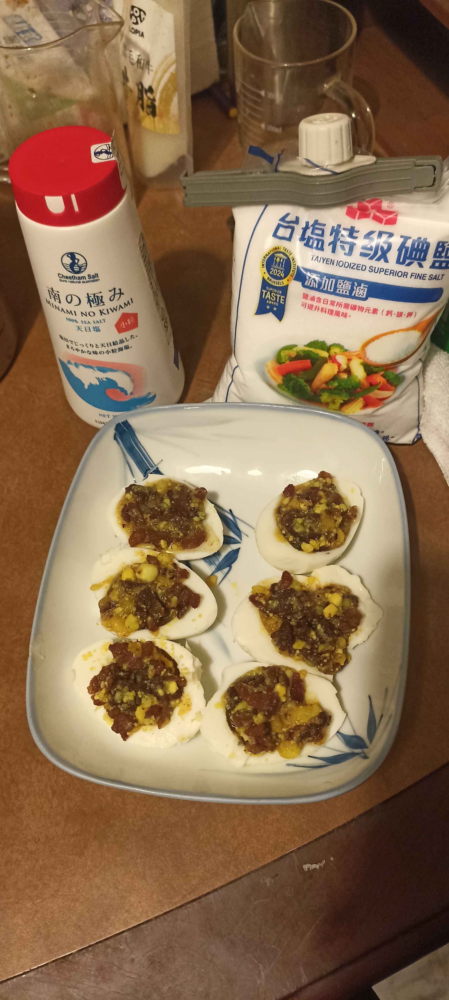[grilled courgette, pan-fried roe and mulled wine]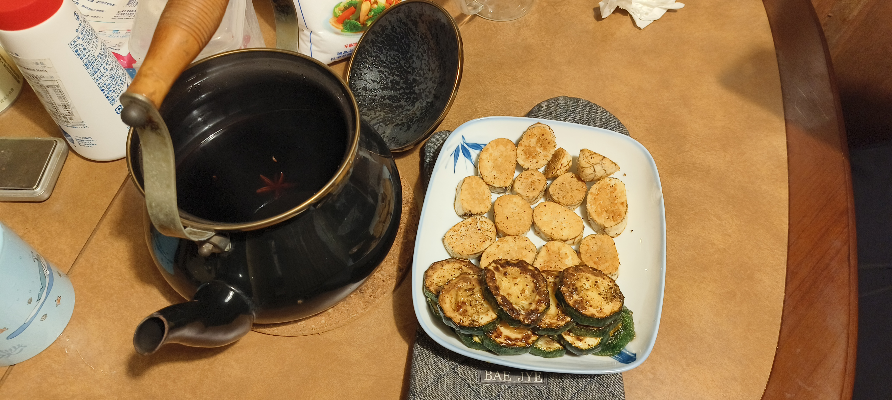
- 23:06 89mg/dL₅(15⁵⁵,3¹⁷){(6+6)T<內>T}

#### 20260227Fri
- 06:29 163mg/dL₄(7¹⁸,){6H<B}〘睡 to 10:00〙<!--睡前吃蛋白質-->
- 10:07 46mg/dL₃(10⁵⁶,3³³), [醬,cf. ],{4R½I>B,7T>內}[devil-egg]〘W〙
- 17:29 85mg/dL₂(5³⁶,5³⁷){6T<T,2R<B}[spinach(炒菠菜)]
- 23:07 35mg/dL₁(3³⁵,3³⁶)[ml₄]
- 00:32 80mg/dL¹(5⁰,5⁰){(5+5)T>A>內}

#### 20260228Sat
- 07:55 65mg/dL²(7¹⁷,)[cf., 沙拉(少) BC.]<!--BC.=bullet-proof coffee-->
- 13:19 107mg/dL³(12⁴¹,){7T<A,3½R½⁺I>B}[豚炒櫛瓜+菠菜]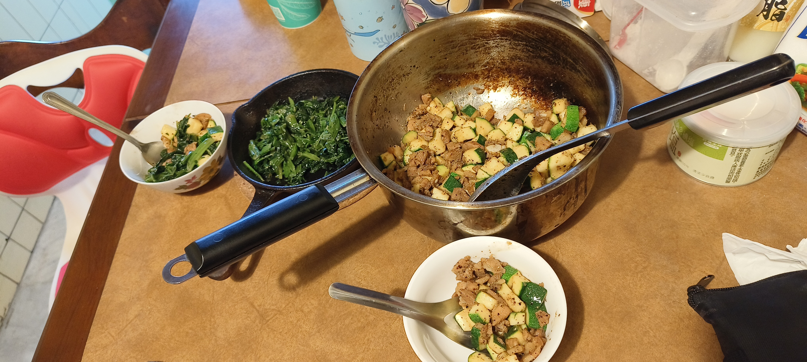〘W₂〙<!--walked for 2 hours without drinking/eating salt, feeling tired and exhausted, thinking unpleasant memories and violent imagination about people and family-->
- 17:51 78mg/dL⁴(4³⁰,4⁶,〘W₂〙⁰)[ml.杏],{2R½I<B,}[ml.杏,南瓜籽仁]<!--〘W₂〙⁰: walking for 2H today-->
- 23:48 100mg/dL⁵(10²⁶,2¹⁷,〘W₂〙⁰){(7+7)T<內>T,1.2R<B}

#### 20260301Sun〘W₂〙¹<!--The day 1 after walking for 2H-->
- 07:55 27mg/dL⁶(7⁵⁶,)[ml.],{7T>A,2R>B}[ml.豚三層,cf.南瓜籽仁]
- <!-- 11:11 --> 136mg/dL⁷(2⁵⁴,2⁵³){6R<B},{5R1⁻II>B}[豚,魚,菜,豆腐,ml₃,cf.]
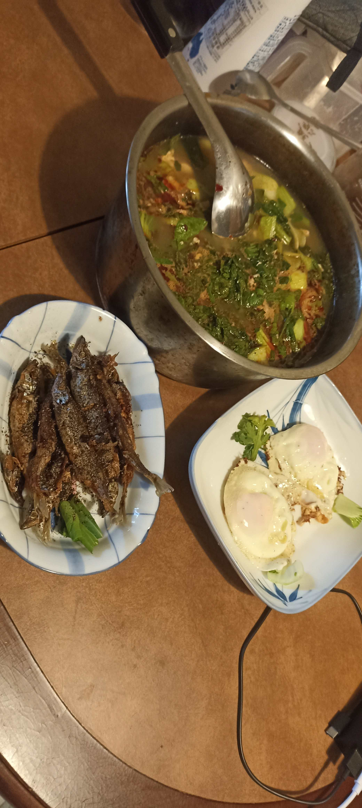
- 15:20 65mg/dL⁸(7²,2³⁵)[ml.],{17:35: 7T<T,2½R<B}
- 21:08 85mg/dL⁹(3³²,3³²)[鹽₄,雞胸肉₂],{3R>內}<!--salt-eating notation added-->
- 00:35 125mg/dL⁰(6⁵⁹,2⁰){(7+7)T>B>T, 0.8R<B}

#### 20260302Mon
1. 06:24 118mg/dL⁰(5⁴⁵)
    - {3H>B}〘睡〙<!--feeling terrible-->
2. 10:07 38mg/dL⁹(,3⁴⁰)[BC.鹽,豚三層+菜,鹽]
    - {3½R<B,7T<内}[BC.鹽]<!--feeling terrible, but recovered after eating-->
3. 16：48 63mg/dL⁸(4⁴⁰,4⁴²)〘W+鹽〙[beer+鹽]
    - {3½R½I>B}[豚,豆腐,蛋+山茼蒿,鹽]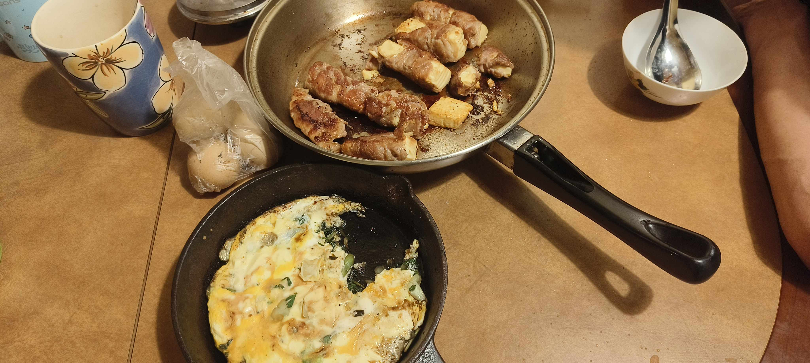[cf.,ml₂]
4. 23:00 36mg/dL⁷(,3⁵⁰)[cf. ml₃]
    - {00:34: (5+5)T<T<A}

#### 20260303Tue
1. 07:02 130mg/dL⁶(6²⁷,)
    - {3H<B, 7T>A}₂〘鹽₂,睡〙<!--felt not good with peeing several times at night and going to sleep again, but better than yesterday-->
2. 10:16 70mg/dL⁴(2³⁹,3¹³)[cf.鹽,豚三層,菜],
    - {3R½I>B}[BC.egg₁,鹽]〘17:45: W½〙
    - {17:48: 3½R½I<B}[Burgerking without buns+鹽,fries. 澱粉,糖,diet coke+鹽],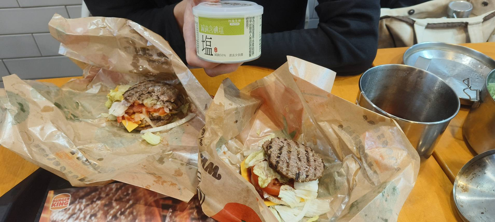
    - {6R>B}〘W₁〙[diet coke+鹽]<!--eating out without bloodsugarmeter-->
3. 21:48 29mg/dL⁵,[ml₅鹽,芝麻粉+乳清,豆腐]
4. 23:57 46mg/dL³(16²⁰,3⁵²)
5. 01:42 90mg/dL²(,5³⁹)
    - {2½R<B,(6+6)T>T<A}₃

#### 20260304Wed
1. 08:48 94mg/dL¹(6⁵⁸,)<!--pee₂+鹽. Feel away better, and no back sleep again-->
    - {7T>A,2½R>B}[cf.鹽]
2. 13:05 54mg/dL₁(4⁶,4³)[豚三層+菜]
    - {3⁻R½⁺I<B}(5¹⁴,5¹¹)[BT.鹽], 〘睡〙<!--BT.=bullet-proof tea. When eating meat, insulin must be injected or sleeping happens.-->
3. 18:46 39mg/dL₂(9⁴⁵,4³¹)[BT.鹽]
    - {3⁺R½I>B}[豚三層,菠菜. 油蔥酥, 鹽]
    - {3H<B}(13²²,2³⁴),[油蔥酥,beer,豆腐,花生,鹽]
4. 00:57 112mg/dL₃(15¹⁸,2³³)
    - {4½R>B,(6+6)T>內<A}
5. 02:13 137mg/dL₄(0⁵⁰,0⁵³)
    - {3½R<B}

#### 20260305Thu
1. 06:54 26mg/dL₅(5³¹,4³⁹)[鹽,15cg,]〘睡〙
2. 09:39 93mg/dL₆(8¹⁶)
    - {4R>B,7T>A}[豚三層,菜. 油蔥酥, cf.]
3. 15:11 122mg/dL₇(4⁵⁹,5⁰)
    - {4I<內,3R>B}〘W1〙[chedda cheese,鹽]<!--feel hypo when walking-->[ml₄,豚,菜,豆腐,鹽]
    - {21:04: 3R<B}〘W½〙<!--feel hyper-->[堅果,beer,tea]
4. 22:52 146mg/dL₈(12⁴⁰,1⁴⁷)
    - {4H>B}〘bed-yoga〙
5. 00:47 65mg/dL₉(14³⁵,1⁵¹)[堅果]
    - {(5+5)T<T>內}

#### 20260306Fri
1. 04:47 67mg/dL₀(2⁵¹,)〘pee, check BG and go back sleep〙
2. 06:43 65mg/dL₀(4⁴⁷,)<!--pee 3 times at night, mental score is about 6~7-->[cf.鹽,堅果(少)]
3. 09:18 72mg/dL₉(7²²,)[cf.鹽]
4. 12:01 79mg/dL₈(10⁵,)[tea鹽]
    - {5T<A}[tea杏鹽]
5. 16:14 78mg/dL₇(4⁴,)
6. 18:55 67mg/dL₆(6⁴³,)<!--5T ia too much (in fasting), and it shows its power in 6 hours-->
    - {3R½I>B}[油蔥酥,牛漢堡,豆腐,鹽]
|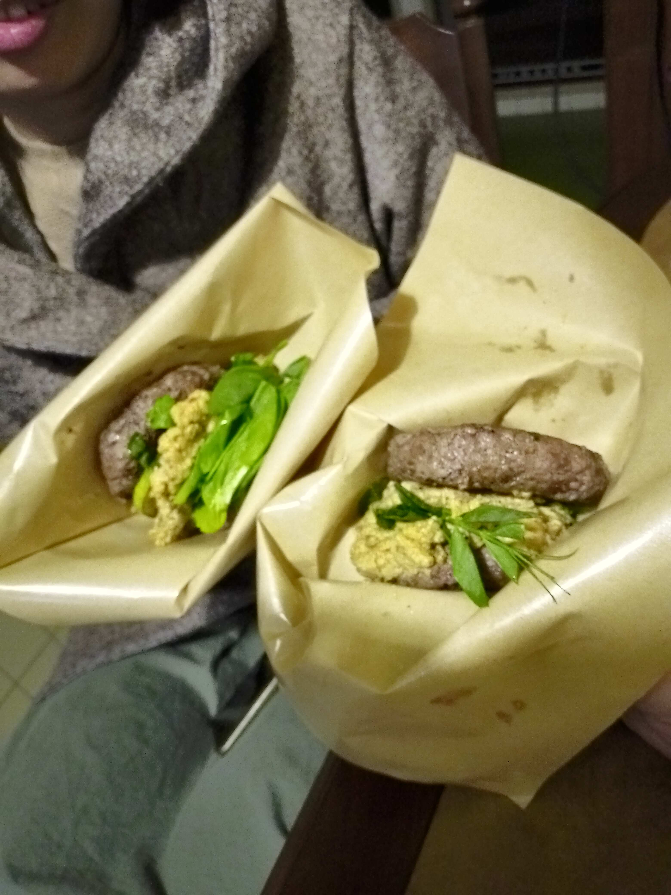|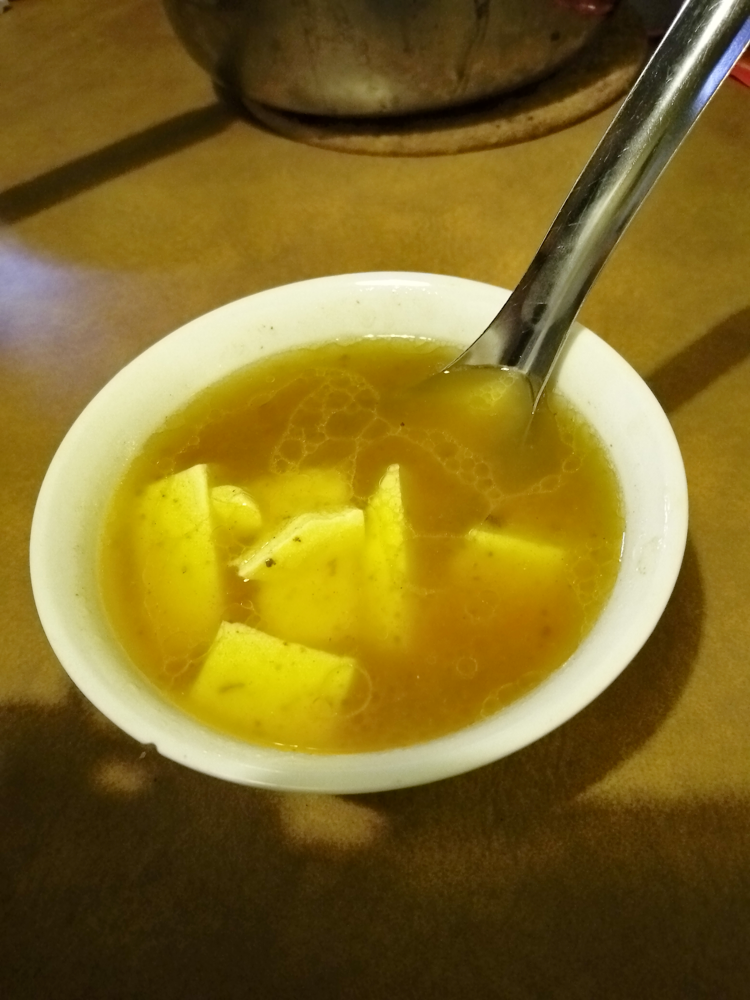|
7. 22:01 113mg/dL₅(9⁴⁹,3¹)
8. 22:39 130mg/dL₆(10²⁷,3³⁹)<!--應在發現吃過多時在餐中/後再補打一劑-->
    - {1½H2½R<B,(6+6)T<內>A},〘W₁〙,[cf.鹽]

#### 20260307Sat
1. 05:06 84mg/dL₃(6²⁰,6²⁵)〘睡〙
2. 08:26 102mg/dL₂(9³⁹,)[cf.鹽]<!--felt better after drinding almost immediately-->
    - {3R>B,5T>A}〘W₁〙[cf.鹽]
3. 14:34 46mg/dL₁(5⁴⁸,5⁵⁰)<!--hypo but ok, will eat sth-->[肉,egg. tea鹽]
4. 18:03 160mg/dL¹(9¹⁸,9²⁰)[ct.+salt]<!--ct.=Carmién Tea-->
    - {2½H2R<B}
5. 20:11 80mg/dL³(11²⁵,2³)
6. 21:40 32mg/dL⁴(12⁵⁴,3³³)[肉,菜,黑芝蔴糊(starch+oil)]
7. 00:36 77mg/dL⁵(15⁵⁰,6²⁸)
8. 01:08 78mg/dL⁶(16²²)
    - `{(5+5)T>T<A}`

#### 20260308Sun
1. 03:55 80mg/dL⁷(2⁴¹,)[鹽]<!--pee then go back sleep-->
2. 07:58 63mg/dL⁸(6⁴⁴)[cf.鹽]
3. 12:42 81mg/dL⁹(11²⁸)[ct.鹽]〘scooter-riding₁〙[ct.鹽]
4. 16:53 87mg/dL⁰,[tea鹽]〘scooter-riding₁〙
5. 19:49 97mg/dL⁰(18³⁵)
    - `{2½R½I>B}`[豚三層,菜,蛋,鹽]
6. 21:56 59mg/dL⁹(20⁴²,1⁵³)[堅果:腰果,杏仁,南瓜子,核桃. half of beer]
7. 23:31 66mg/dL⁷(22¹⁸,3²⁹)
    - `{(3+3)T>内>A}`[鹽(4g)]〘bed-yoga〙

#### 20260309Mon
1. 04:28 150mg/dL⁶(4³⁸)
    - `{2½H2R<B}`〘睡〙
2. 07:07 92mg/dL⁵(7¹⁷,2³⁶)〘睡〙
3. 10:28 71mg/dL⁴(10³⁷,5⁵⁶)
    - `{3½R½I>B}`[豚三層,鹽]
4. 16:33 132mg/dL³(16⁴³,4⁶)
    - `{3½H<B}`
    - `{18:43 3½R½I>B}`[火鍋湯底,菇,菜,豚三層,egg₂,cheese]
5. 21:38 110mg/dL²(21⁴⁹,2⁵⁶)
    - `{3½H<B}`[ml₃,黑芝麻糊,乳清蛋白,杏,ct.]
6. 00:18 112mg/dL¹(24²⁸,2²⁵)
7. 01:22 136mg/dL₁(25³²,3²⁹)
    - `{1½H1R>B,(3+3)T<T<A}`

#### 20260310Tue
1. 07:02 158mg/dL₂(5²⁹,5³³)
    - `{4½H<B}`〘睡〙
2. 10:55 109mg/dL₃(9²²,3⁴⁸)
    - `{4½R>B}`[剩菜:菜,豚三層,egg][黑芝麻糊,乳清蛋白,cf.鹽]
3. 14:05 159mg/dL₅(12³¹,2³⁰)
    - `{4H<B,4T>A}`[18:19 肉沫油湯鹽]
4. 20:14 100mg/dL₆(6⁰,6⁰)[ct.杏鹽]
5. 23:13 125mg/dL₇(9⁰,9⁰)<!--4T less than 8 hours-->
    - `{1H>B,(4+4)T>A<內}`[2.2g鹽(3 capsules)]<!--stomach pain after salt-capsule, water solve it-->

#### 20260311Wed
1. 05:26 124mg/dL₈(6⁰,6³)[鹽]〘睡〙
2. 10:54 84mg/dL₉(11²⁸,5²⁰)
    - `{4R½⁺I>B,5T>T}`[豚三層,egg₃鹽],[漢堡肉₁,櫛瓜,egg₂]
3. 15:20 120mg/dL₀(2³⁰,2³²)
    - `{2½H<B}`[BC.鹽]
4. 18:51 102mg/dL₉(6²,3²⁷)<!--5T is eliminated in 6-7 hours-->
    - `{5T<A}`〘W₁.₅+鹽〙
5. 20:50 145mg/dL₈(1⁵⁴,)<!--5T won't start in 2 hours-->
    - `{3½H>B}`[鹽BT.]
6. 00:13 77mg/dL₇(5¹⁶,3¹⁸)
7. 02:42 81mg/dL₆(7⁴⁶)
    - `{7T>內}`

#### 20260312Thu
1. 08:48 118mg/dL₅(6¹,)
    - `{2H<B}`<!--pee:2, 5&5.5-->〘睡〙
2. 11:35 88mg/dL₄(8⁴⁸,2⁴³)
    - `{4⁺R½I>B}`[豚三層,egg₂鹽]
    - `{5I<A}`[ct.杏鹽]<!--using I instead of T for gluconeogenesis-->
3. 16:53 99mg/dL(2³⁰I,4³²)〘W₁.₅+鹽〙
4. 20:09 106mg/dL₁<!--BG is fine-->
    - `{20:11 5⁻R0⁺I<B}`[聚·北海道鍋物：糖,澱粉,肉,菜]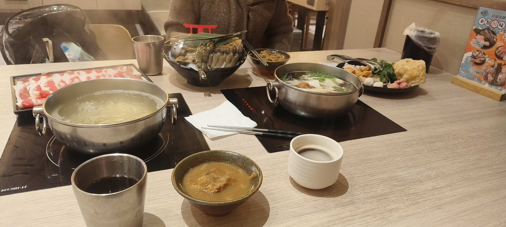
5. 22:17 147mg/dL¹(7⁵³,2⁵)
    - `{5H>B}`[cf.杏鹽]
6. 02:43 132mg/dL²(12²⁰,4²¹)
    - `{5R<B,7T<T}`

#### 20260313Fri
1. 06:38 105mg/dL³(3⁴⁸,3⁴⁷)<!--pee:2,5&5½-->
    - `{4⁻R>A}`[BC.鹽]
2. 13:08 109mg/dL⁴(10¹⁸,)
    - `{5I<內}`
3. 18:49 133mg/dL⁵(5³⁸:5I)
    - `{3⁻H5R>B}`[豚,牛,菠菜,egg₃,菇]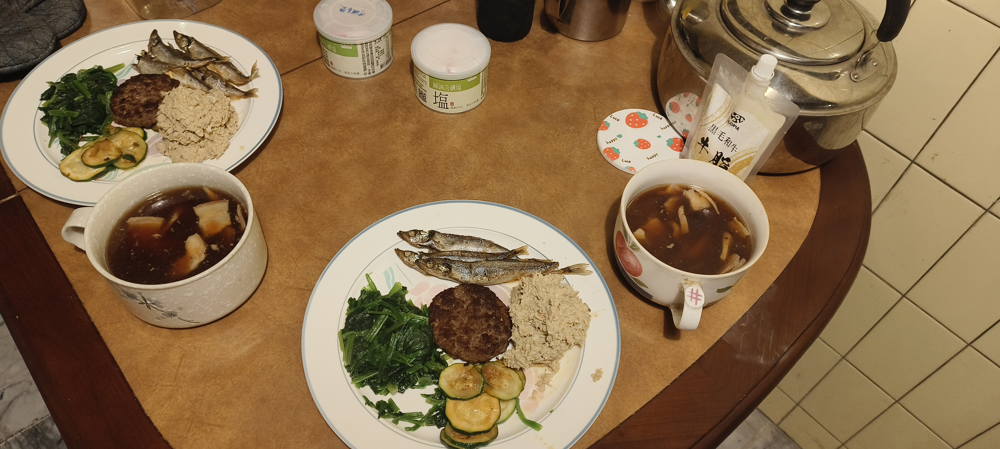
4. 21:50 92mg/dL⁶(19¹7T,8³⁹5I,2⁵⁸)
    - `{7T<A,3R>T}`

#### 20260314Sat
1. 00:52 50mg/dL⁷(2³⁴,2³³)〘睡,not back-sleep〙
2. 06:23 67mg/dL⁸(8⁶,8⁵)[cf.BC.鹽]
3. 09:33 144mg/dL⁰(11¹⁶,,)
    - `{3⁺H2⁻R<B}`〘W₁〙[豆製品(少),cf.]
    - `{6I>A}`[豆製品,肉湯]
4. 15：55 81mg/dL⁰(,1⁵⁰,)
    - `{4⁻R>B}`[豚三層,egg₂,鹽]
5. 22:53 125mg/dL⁹(,8⁴⁸,5⁵)
    - `{6T>内,4R<B}`

#### 20260315Sun
1. 06:51 49mg/dL⁸(7⁵³,7⁵¹)<!--1,5.5&6-->
    - `{5I<A}`[ml.+BC.,cf.鹽,肉]
2. 10:29 124mg/dL⁷(11³¹,3¹⁵,)
    - `{3½H2½R>B}`[plain-yogurt(lots carb)]
    - `{12:28: 4I<B}`[cf.鹽]〘W₁〙[肉,ml.+yogurt,漢堡肉₁]
3. 18:10 117mg/dL⁶(,5⁴¹,)
    - `{5⁺R>B}`[肉,菜,egg₂,漢堡肉₁]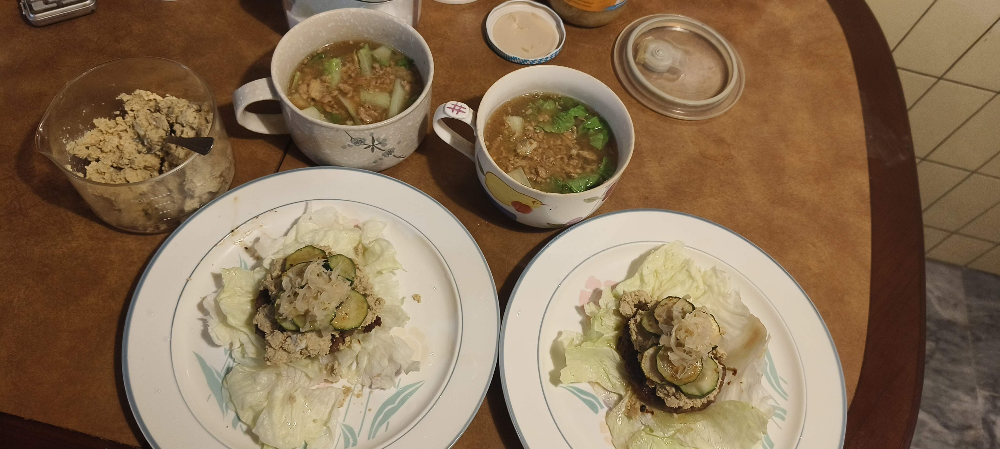,[plain-yogurt]
4. 21:41 140mg/dL⁵(,9¹²,3²⁹)
    - `{5H<B}`[plain-yogurt,ml.]
5. 23:57 115mg/dL³(,11²⁸,2¹³)
    - `{3⁻R>A,6T<T}`

#### 20260316Mon
1. 05:28 159mg/dL¹(5⁰)
    - `{4½H<B}`〘睡〙
2. 07:59 120mg/dL₁(7³¹,,2²⁸)<!--(2,5,5.5)-->
    - `{2½H>B}`[cf.鹽]
3. 12:11 115mg/dL₂
    - `{2H4½R>T}`[大全聯: 味噌炸豚排(裏澱粉),大雞腿(塗糖醬)]
    - `{6⁺I<A}`
4. 14:49 240mg/dL₃(,0⁵⁷,)<!--sleeping because of hyper-->
    - `{(6+6)H<>BB}`[cf.ml.]
5. 17:09 31mg/dL₄(3¹⁷,2¹⁶)[ml.+10g GP.,乳清蛋白₂]<!--GP.=glucose-powder-->
6. 18:42 103mg/dL₅(,4⁵⁰,3⁴⁹)
    - `{4R½I<内}`[豚,菜,egg]
7. 23:44 223mg/dL₆
    - `{6½H<B}`[ch.₃]<!-- ch.=cheese -->
8. 01:48 176mg/dL₇
    - `{7R>B}`

#### 20260317Tue
1. 07:03 77mg/dL₈(,5⁷)
    - `{6I>A}`〘睡〙
2. 10:45 97mg/dL⁹(,3³³,)[ml.(少)]
    - `{5R<B}`[豚三層,egg₂]
    - `{6I<T}`
3. 15:11 167mg/dL⁶(,1³⁰,3³²)
    - `{5H>B}`[BC.杏]
4. 16:29 133mg/dL⁵(,2⁴⁹,1¹⁵)
5. 17:48 87mg/dL⁶(,4⁸,2³⁴)
    - `{4⁺R½⁻I<B}`〘W₂〙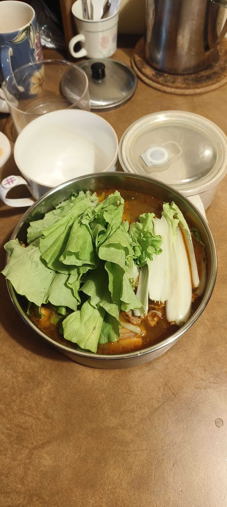
6. 21:52 85mg/dL³(,8¹⁵,3⁴²)[pumpkin-seeds]
7. 00:56 185mg/dL⁴(,11¹⁶,6⁴⁶)
    - `{3H4R>B,8T>内}`
8. 02:13 166mg/dL⁵(,,1¹⁴)

#### 20260318Wed
1. 07:14 103mg/dL⁶(6¹⁴)
    - `{2½R<A}`〘睡〙
2. 11:07 101mg/dL⁷(10⁸,,3⁴⁹)
    - `{2½R<B}`[pumpkin-seeds]
3. 13:28 131mg/dL⁸(,,2⁵)
    - `{4½H>B}`[BC鹽]
4. 17:46 72mg/dL⁹(,,4¹³)
    - `{3½R½I<B}`[豚,egg₃,菜,豆腐(少),pumpkin-seeds]
5. 20:02 96mg/dL⁰
    - `{5I>B}`[BT.鹽]
6. 22:36 166mg/dL⁰(,2²⁴,4⁴⁵)
    - `{6H<B}`[ch.]〘bed-yoga〙

#### 20260319Thu
1. 03:41 95mg/dL₉(,,5²)
    - `{½H2½R>T}`<!--(0,6.5,7)-->[BT.杏]
2. 07:21 97mg/dL⁸(,,3³⁷)
    - `{2R>A}`[BC.杏]
3. 11:23 102mg/dL⁷(,,3⁵²)<!--slewp for about 1½h, (0,5,5.5)-->
    - `{3H>B}`[BC.鹽]
4. 14:11 94mg/dL⁶(,,2³⁶)
    - `{5I<B}`[hypo(,1⁴⁸,): 南瓜子]
5. 18:06 192mg/dL⁵(,3⁴⁶,)
    - `{7H>B,7R<内}`[豚,菜,ch₁]
    - `{6I<B}`
6. 20:36 126mg/dL⁴(,0²⁶,2²⁹)
    - `{7T<T,3N>B}`[豚,南瓜子,啤酒]
7. 23:08 32mg/dL³(2³⁰,3⁰,2²⁸)[ml.,15g(glucose powder)]
8. 01:33 138mg/dL²(4⁵⁴,5²²,4⁵²)
    - `{1½H4R<B,7T>内}`

#### 20260320Fri
1. 08:54 175mg/dL¹(7⁶,,)<!--(2,5,4.5)-->
    - `{7H>B,7T>T}`〘睡〙
2. 11:22 138mg/dL₁(9³⁴,,2²⁵)<!-- not so well-being, but better than days before -->
    - `{5H<B}`[南瓜子,ml.,cf.]
    - `{4H>B,7T<A}`[豚,菜,egg₂]
    - `{4R1I<T}`[乳清蛋白]
3. 16:18 77mg/dL₂(3²⁰,,2⁰)
    - `{5½R½I<B}`[豚,egg₃,豆腐,菜]
4. 20:23 141mg/dL₃(7²⁶,,1⁵¹)
    - `{3½R3N>B,6T>A}`
5. 23:35 56mg/dL₄(3⁸,,3¹⁰)[15g,ml.]
6. 00:14 66mg/dL₅[6g,ml.]
    - `{2½R<内,6T<B}`

#### 20260321Sat
1. 03:31 107mg/dL₆(3⁷,,3⁸)
    - `{2⁻R>B}`〘睡〙
2. 09:25 106mg/dL₇(9⁰,,)
    - `{6T<A,2H<B}`<!--(2,5,4.5)-->[cf.鹽]〘W₁〙
3. 13:10 118mg/dL₈(3⁴¹,,3³²)
    - `{2⁻H>B,5I>T}`[cf.鹽]
4. 17:15 45mg/dL₉(7⁴⁶,4¹,4³)[15g]
    - `{3½R1½I<B}`[豚,egg₂,菜,豆腐]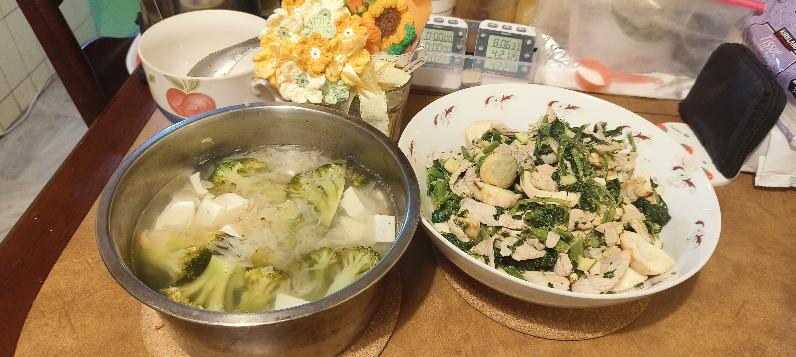
5. 19:15 77mg/dL₀(9⁴⁶,6¹,6²)
    - `{4⁺I>内}`〖W½〗<!--hypo feeling-->
6. 21:25 57mg/dL₀(,2⁷,3⁵²)[6g,糖(少)]
7. 23:14 87mg/dL₉(,3⁵⁷,)<!--I can't concentrate on my reading-->[6g+鹽+butter]<!--twittering instead of reading-->
8. 00:51 88mg/dL₈(,5³⁴,)
    - `{7T>A,2½R<B}`<!--yoga-->

#### 20260322Sun
1. 07:36 37mg/dL₇(6³⁶,,6³³)<!--hypo felt, 1,6,6-->
    - `{5½I<A}`[cf.鹽杏]
2. 12:03 131mg/dL₆(,3³³,)[cf.鹽杏]
3. 14:02 139mg/dL₅(,5²⁸,)
    - `{2½H>B,5T<T}`
4. 16:11 90mg/dL₄(1⁵⁸,7³⁷,2⁰)[tea,鹽]
5. 18:04 53mg/dL₃(3⁵²,9³⁰,3⁵⁴)[貢丸,蛋餃,豚,egg₃,菜]<!--hypo feeling-->
    - `{5R<B}`[貢丸,蛋餃,豚,菜]
6. 21:09 75mg/dL₂(6⁵⁶,,2³⁰)[南瓜子,tea杏]
7. 22:44 96mg/dL¹(8³¹,,4⁵)<!--cannot focus on reading, agitated and violent scenes emerging-->
    - `{7T<内,3½R>A}`[南瓜子(少)]
8. 01:25 110mg/dL²(2²⁶,,2²³)
    - `{2R>B}`[4g]

#### 20260323Mon
1. 06:49 127mg/dL³(7⁵⁰,,5²¹)
    - `{3⁻R<B}`[南瓜子]〖睡〗
    - `{2R>B}`〖睡〗
2. 11:29 106mg/dL⁴(12³⁰,,2⁷)
    - `{4⁻R<A}`[南瓜子]<!--(4,4.5,4),not good-->[cf.鹽]<!--a terrible day with bad sleeping, foggy and agitated-->
    - `{6⁻I>T}`[晚餐剩菜,南瓜子]
    - `{3⁺R>内}`
    - `{4⁻R<B,7T>A}`[ch.,egg₃,豚,菜]
    - `{3½I>B}`[BT.]
3. 20:16 54mg/dL⁵(3⁸,1⁴⁴,3⁹)[南瓜子,6g,啤酒]
    - `{3½I>B}`
4. 22:32 85mg/dL⁶(5²⁴,0³¹,)
5. 01:28 98mg/dL⁷(8²⁰,3²⁷,)
    - `{3I<B}`[南瓜子]
6. 03:23 120mg/dL⁸(,1⁴⁴,)
    - `{4½R>B,6T<T}`

#### 20260324Tue
1. 06:32 41mg/dL⁹(2⁵⁶,,2⁵⁸)
    - `{2H<B}`〘睡〙
2. 10:03 32mg/dL⁰(7¹⁰,,3³⁸)<!--0,5,5.5-->
    - `{6I<A}`[egg₂,酸菜,cf.杏]<!--feel good-->
3. 13:05 113mg/dL⁹(9²⁹,1⁵⁸,)
    - `{3⁺R>B}`[cm.杏鹽]
4. 16:12 96mg/dL⁸(,5⁶,2⁵⁵)
    - `{2½R<B}`
    - `{4I<内}`(,6⁵,0⁵⁵)
5. 18:00 64mg/dL⁷(,0⁴⁸,1⁴⁴)[豚,egg₂,菜]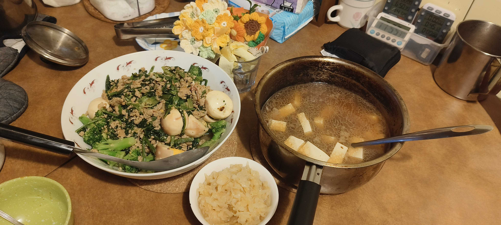
    - `{3⁺R>T}`(,1⁵⁰,2⁴⁶)<!--sleeping; too late to take bolus shot-->
6. 20:45 54mg/dL⁶(,3³³,1⁴²)[花生,ml.(少)]
    - `{1H1R>B}`(,4¹²,2²⁰)
    - `{½H1½R>A}`(0,5⁵⁶,1⁴⁴)<!--agitated so take a little dosage-->[ml.(少)]
7. 00:20 58mg/dL⁵(,7⁸,1¹¹)[8g]
    - `{3⁻R<A,7T>内}`

#### 20260325Wed
    - `{02:40 4⁻R<B}`
1. 06:30 79mg/dL⁴(5⁴⁵,,7²²/3⁵¹)<!--pee:3, sleep terrible-->
    - `{2R6T<T}`〘睡〙
2. 11:09 95mg/dL³(4²⁸,,4²⁸)<!--keep peeing, feeling bad-->
    - `{3H6T<内}`[ml.(少),cf.]
3. 14:30 139mg/dL²(3¹⁸,,3¹⁸)
    - `{2½H4R<B}`[egg₂,酸菜,fat],[ml.,cf.,fat]
4. 18:20 120mg/dL¹(6⁵⁷,,3³⁷)
    - `{4½R½I>B}`[雞肉,egg₃,酸菜]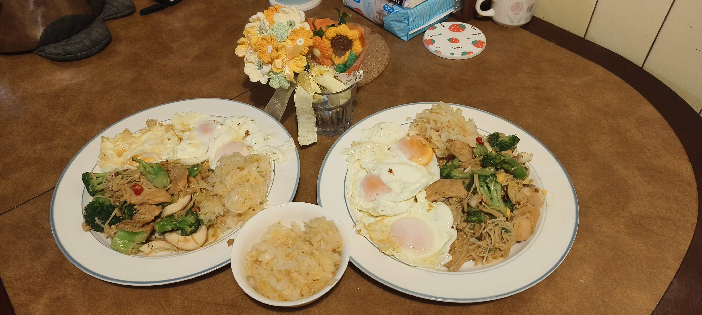
    - `{3R1⁻I>A}`(9⁴⁸,,2¹⁵)〘W₁〙
5. 22:39 72mg/dL₁(,,1³⁷)[ml₄+cm.+butter+鹽]
6. 00:19 136mg/dL₂(,,3¹⁶)
    - `{2½H2R<B}`[南瓜子]
7. 02:34 91mg/dL₃(,,2¹⁰)
    - `{2⁺R>内,(4⁺+4)T>T<A}`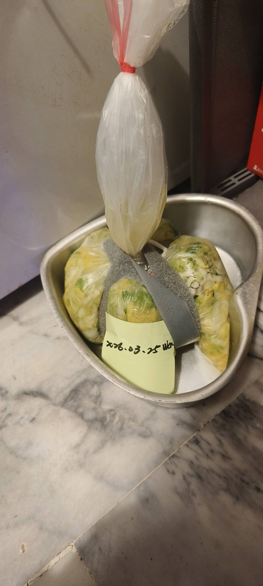

#### 20260326Thu
1. 07:11 37mg/dL₄(4²³,,4²⁵)[南瓜子,ml.(少),cf.]<!--0,5,5.5; feeling quite good. BG will go up 'cause DP, so I'll check it later.-->
2. 10:10 161mg/dL₅(7²²,,7²⁴)
    - `{6H>B,7T>A}`[cf.,杏]
3. 12:35 111mg/dL₆(2²²,,2²³)
    - `{2⁺I<B}`
4. 15:16 83mg/dL₇(5³,2³²,5⁴)[南瓜子,BC.]
5. 18:22 87mg/dL₈(8⁹,5³⁹,)
    - `{5½R½I>B}`[dinner: 豚(多),egg₂,菜,豆腐,酸菜]
    - `{7T<T,4R<B}`(10¹⁸,7⁵⁰,2⁶)[ml.(少),cm.杏]
6. 22:35 82mg/dL₉(2⁴,,2³)[ml₃+fat鹽]
    - `{3⁺R<内,6T<A}`

#### 20260327Fri
1. 04:00 120mg/dL₀(4⁶,,4⁷)
    - `{3⁺R>B}`〘睡〙
2. 08:38 147mg/dL₉(8⁴⁵,,4³⁶)
    - `{6½H<B,7T>A}`〘睡〙
    - `{11:51 4⁻R<B}`[豚三層,egg₁酸菜]
    - `{14:02 7T>内,2½R2½I>B}`
    - `{15:39 5⁻H<B}`[ml₃+cf.+fat鹽]
3. 18:07 90mg/dL₇(4⁷,,2²⁸)[南瓜子]
4. 20:05 86mg/dL₆(6⁶,,4²⁶)〘睡〙
5. 22:30 106mg/dL₅(8³¹,,6⁵²)
    - `{7T>T,2½H>B}`[椰奶+fat鹽],[椰奶+fat鹽]
6. 03:30 93mg/dL₄(4⁵⁶,,4⁵⁵)[南瓜子]
    - `{7T<A,4⁻R<T}`(6³³,,6³²)

#### 20260328Sat
1. 10:18 97mg/dL₃(5¹²,,5¹¹)
    - `{7T>A,2½>B}`
    - `{11:27 5R1⁻I<B}`[「聚」火鍋:澱粉,肉,菜]
    - `{14:16 5⁺R>T}`(9¹⁰,,2⁴⁸)
2. 16:19 223mg/dL₂(,,2³)
    - `{16:21 7½H>B,7T<A,3R3I<内}`〘W½〙
3. 19:44 45mg/dL₁(3²²,,3²³)[23g powder milk(≈9g乳糖)+butter]
    - `{22:05 7T<B}`
4. 00:34 102mg/dL¹(2²⁹,,)
    - `{00:44 7T>B,5⁻R<T}`

#### 20260329Sun
1. 08:35 34mg/dL²(7⁵¹,,7⁵⁰)[南瓜子,cf.鹽]
    - `{09:46 6I>A}`
2. 11:53 98mg/dL³(,2⁶,)
    - `{12:53 6R<B}`[豚,酸菜,BC.,椰奶]
3. 15:23 115mg/dL⁴(,5³⁷,2³⁰)
    - `{15:25 6⁺T>内}`
    - `{15:28 3½R>B}`〘W½〙[水煎包(少)]
4. 18:10 52mg/dL⁵(2⁴⁴,,2⁴²)[ml.,澱粉,]
    - `{19:23 4⁻R<B}`[egg₂,豚,酸菜]
5. 21:37 192mg/dL⁶(6¹²,,2¹⁴)
    - `{21:40 (7+5)R>B<A}`
6. 00:33 57mg/dL⁷(9⁷,,2⁵³)[Doritos,15g]
    - `{01:05 (5+5)T>T<B}`
7. 03:09 73mg/dL⁸(2³,,)
    - `{03:21 2R<内}`

#### 20260330Mon
1. 08:38 39mg/dL⁹(7³³,,5¹⁸)[10g,Doritos, 南瓜子]
    - `{08:49 7T<A}`
    - `{08:50 2R>B}`[Doritos]
2. 12:03 121mg/dL⁰(3¹⁴,,3¹³)
    - `{12:06 1⁺H4⁺R<T}`[banana. Egg₂+酸菜]
3. 14:31 121mg/dL⁰(5⁴³,,2²⁵)
    - `{14:42 2H6T>内}`
4. 17:43 60mg/dL⁹(3¹,,3¹)[豚,菜]
    - `{18:05 4R½I<B}`[豚,菜]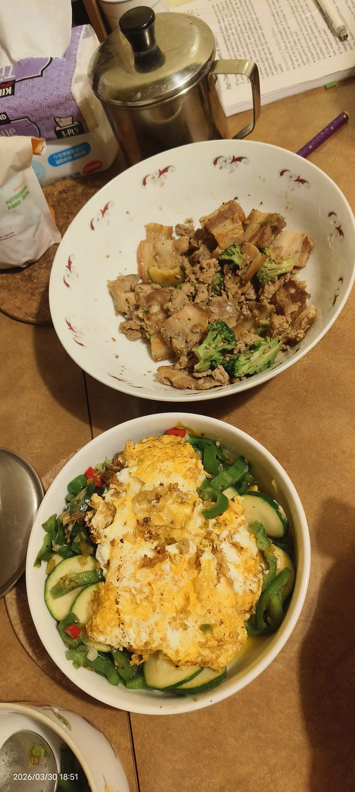
5. 20:27 98mg/dL⁸(5⁴⁵,,5⁴⁵)
    - `{20:45 3H>B}`[beer,南瓜子]
6. 22:46 97mg/dL⁷(8⁴,,2²)
    - `{23:24 (6+6)T>A>T}`
    - `{23:25 3½R<B}`

#### 20260331Tue
1. 06:18 161mg/dL⁶(6⁵⁴,,6⁵²)
    - `{06:20 6½H>B}`〘睡〙
2. 09:48 67mg/dL⁵(,,3²⁸)
    - `{11:47 5R<A}`[剩菜,egg₁+butter+cf.+tea]
3. 13:49 118mg/dL⁴(,,2⁰)
    - `{13:54 2½H7T<内}`
    - `{17:29 4½R<T}`[豚三層,酸菜]
4. 19:25 151mg/dL³(5³¹,,1⁵⁶)[[BT.+egg₁]
    - `{19:29 4N6T<B}`[BT.+egg₁,南瓜子,banana]
5. 23:16 189mg/dL²(3⁴⁶,,3⁴⁶)
    - `{23:19 5H>B}`
6. 00:52 171mg/dl¹(5²³,,1³³)
    - `{00:58 5R>T}`
    - `{00:59 7T>A}`

#### 20260401Wed
1. 03:27 86mg/dL₁(2²⁸,,2²⁹)
    - `{03:32 3½I<A}`〘睡〙[南瓜子,鹽]
2. 06:59 75mg/dL₂(6²,3²⁸,)
    - `{07:04 6½T>内}`〘睡〙[南瓜子,鹽]
3. 09:12 85mg/dL₃(2⁸,5⁴⁰,)
    - `{09:15 3I<B}`〘睡〙[南瓜子,鹽]
4. 11:04 75mg/dL₄(4²⁹,2¹⁸/8²,)[10g]
    - `{12:56 2H3R>B}`[豚三層,酸菜.,BC+鹽]
5. 14:47 84mg/dL₅(7⁴³,5³²,1⁵²)
   - `{15:01 8T<T}`
6. 16:06 82mg/dL₆(1⁵,6⁵¹,3¹⁰)
7. 18:25 122mg/dL₇(3²⁴,9¹⁰,5²⁹)
    - `{18:29 4H4R<B}`[豚,酸菜,櫛瓜,egg₂,菜]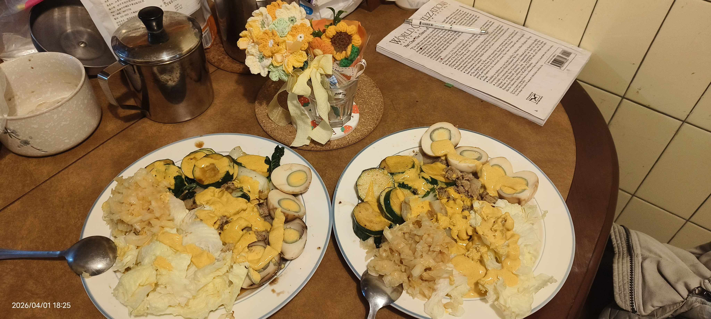
8. 20:56 108mg/dL₈(5⁵⁴,,2²⁶)
9. 22:01 125mg/dL₉(7⁰,,3³²)<!--4R's effect is less than 3h when eating-->
    - `{22:08 3H7T<内}`[BC.+egg₁.,椰奶+芝麻糊(少)]
10. 23:33 129mg/dL₀(8₃₁,,1₂₅)
    - `{23:40 4R>T}`
11. 01:32 118mg/dL₀(3²⁵,,1⁵³)
    - `{01:50 7T>A}`
    - `{01:52 2½R>B}`

#### 20260402Thu
1. 04:03 77mg/dL₉(2¹²,,2¹⁰)<!--(1,6,6)-->
    - `{04:08 1½I<B}`[ml.南瓜子]
    - `{06:54 2½H7T<A}`[BC+egg₁+cf.]
2. 07:44 101mg/dL₈(5⁵⁴/0⁵⁰,3³⁶,0⁵⁰)
3. 08:29 96mg/dL₇(6³⁸/1³⁴,4²⁰,1³⁵)
    - `{08:36 1H2R>B}`[10:04 egg,酸菜,豚]
4. 11:01 53mg/dL₅(4⁷,,2²⁵)[10g,豚₂]
    - `{11:34 3R4T<T}`〘12:00 W½〙
5. 14:53 175mg/dL₄(3¹⁸/7⁵⁸,,3¹⁸)
    - `{14:56 9R>B}`
6. 17:11 95mg/dL₃(5³⁶,,2¹⁵)
    - `{17:48 3R7T<B}`[外食牛排:澱粉,肉,菜]
7. 20:03 64mg/dL₂(,,5⁷/2¹⁵)
8. 21:11 70mg/dL¹(3²²,,3²²)[糖]
9. 22:58 89mg/dL²(5¹⁰,,5¹⁰)
    - `{23:10 3R7T>内}`

#### 20260403Fri
1. 03:50 39mg/dL³(4⁴⁰,,4⁴⁰)[12g]
2. 05:45 78mg/dL⁴(6³²,,)
3. 07:35 71mg/dL⁵(8²⁵,,)
    - `{07:46 4R6T>B}`[7-11外食,coffee]〘W₁〙
4. 12:53 108mg/dL⁶(5⁷,,)
    - `{13:26 4½R7T>T}`[火鍋,料(有澱粉)]
5. 15:18 199mg/dL⁷(1⁵²,,1⁵²)
    - `{15:21 3H6R<B}`
6. 17:33 83mg/dL⁸(4⁶,,2¹¹)[12g]
7. 19:29 127mg/dL⁹(6³,,4⁸)
    - `{19:32 5R7T>A}`[The German sausage]
8. 21:52 94mg/dL⁰(2¹⁹,,2¹⁹)
    - `{22:38 3R7T<内}`

#### 20260404Sat
1. 06:32 41mg/dL⁰(7⁵³)[12g]
    - `{07:09 4½R7T<A}`[cookies.,豚,香腸,菜]
2. 09:09 141mg/dL⁹(2⁰)
    - `{09:11 2H4R>B}`
3. 11:39 73mg/dL⁹(4³⁰,,2²⁸)
    - `{11:41 5R1I<B}`[香腸,肉,菜]
4. 14:02 85mg/dL⁸(6⁵²,,2²⁰)
    - `{14:20 7T<T}`
5. 17:47 103mg/dL⁷(3²⁷)
    - `{17:50 7R>内}`[香腸(少),肉,菜] 
6. 20:41 123mg/dL⁶(6²²,,2⁵²)
    - `{20:49 3½H7T>B}`
7. 01:08 160mg/dL⁵(4²⁰)
    - `{01:16 6R4T<B}`

#### 20260405Sun
1. 06:33 60mg/dL⁴(5¹⁶)〘睡〙
2. 08:55 51mg/dL³(7³⁹)
    - `{08:58 4R7T>A}`[醬,egg₂]<!--feeling not comfortable after going back sleeping, might resulting from without insulin after 6:33-->
3. 13:23 96mg/dL²(4²⁶)
    - `{13:37 5⁺R>B}`[lunch:醬,肉,菜]
4. 16:54 116mg/dL¹(7⁵⁵,,3¹⁶)
    - `{17:03 5R7T<B}`[ml.奶茶],[dinner]
5. 20:46 178mg/dL₁(3⁴³)
    - `{20:49 3H5R>B}`[椰奶,tea]
6. 23:04 110mg/dL₂(6⁰,,2¹⁴)
    - `{23:13 1H3R>T}`
    - `{00:23 5T<内}`
7. 01:53 65mg/dL₃(1²⁹,,2³⁹)[12g]
    - `{02:40 2½R<B}`
    - `{02:41 4T>A}`

#### 20260406Mon
    - `{05:01 3I>B}`〘睡〙
1. 08:08 33mg/dL₄(5²⁸,3⁰⁸,)[12g,椰奶,cf.]
    - `{09:32 5I<A}`
2. 10:04 109mg/dL₅(7²⁶,0³⁵,)
    - `{11:27 6½R<B}`[lunch]
3. 13:04 107mg/dL₆(,3⁵⁵,2⁰)
    - `{13:33 2½R>B}`[椰奶+cf.]
4. 14:04 110mg/dL₇(5⁴,1³,)
    - `{14:44 1½H5I<T}`
5. 16:04 57mg/dL₉(,1¹⁷,1¹⁷)[12g, dinner: 醬,肉]
    - `{16:51 4R>内}`
    - `{18:47 2R7T>A}`<!--in the brink of violent imagination, and can't take 2 shots of R and T but combining them in the bus-->
6. 21:04 129mg/dL₀(2²²)
    - `{21:11 4½R<B}`〘W½〙
7. 22:49 84mg/dL₀(4³,,1³⁹)[醬+肉,8g,椰奶]
8. 00:35 70mg/dL₉(5⁴⁸,,3²⁵)[12g]
    - `{00:49 (4+4)T>T>B}`
    - `{00:53 3½R<内}`

#### 20260407Tue
1. 07:04 92mg/dL₈(6⁴²,, 6³⁸)
    - `{07:35 6I<A}`〘睡〙
2. 09:04 105mg/dL₇(,2¹⁷,)
    - `{09:54 2½R>B}`
    - `{09:56 7T<T}`[椰奶tea]
3. 14:04 82mg/dL₆(4⁵³,7¹⁴,4⁵⁵)
    - `{14:53 4R<B}`[豚]
    - `{18:02 7T>内}`
4. 18:20 57mg/dL₅(8²⁴/0¹⁸,,3²⁸)
    - `{18:23 3½R1½I>B}`[dinner:豚,菜,egg₂]
5. 20:58 96mg/dL₄(2⁵⁶,,2³⁵)
    - `{21:00 3½R<B}`[ml₂]
6. 00:04 112mg/dL₃(6⁹,,3¹¹)
    - `{00:17 (4+4)T>A<内}`
    - `{00:19 5R>T}`

#### 20260408Wed
1. 06:20 106mg/dL₂(6²,,)
    - `{06:27 3⁺R<A}`〘睡〙
2. 09:40 61mg/dL₁(9²³,,3¹³)
    - `{09:43 7T<T}`
    - `{10:43 2R>B}`[12g+BC.鹽]
3. 12:48 121mg/dL¹(3⁴,,2⁴)
    - `{12:51 3⁺R<B}`
4. 15:22 51mg/dL²(5³⁹,,2³¹)
    - `{15:25 3I>内}`<!--3⁺R is too much-->[15g+fat鹽]
5. 18:07 55mg/dL³(8²⁴,2⁴², )
    - `{18:25 7T<内}`<!--having frequent urination feeling and taking 7T-->[egg₃,酸菜]
    - `{20:03 ½I2½R>B}`<!--20:55 the frequent urinated feeling is gone-->
    - `{22:38 2R<B}`
6. 22:40 56mg/dL⁴(4¹⁵,,2³⁶)[12g+BT.,egg₁]
7. 00:41 33mg/dL⁵(6¹⁷,,4³⁹/2⁴)<!--violent imagination-->[24g]
8. 01:37 111mg/dL⁶(7¹⁰,,2⁵⁸)
    - `{01:39 (4+4)T>A>B}`
    - `{01:42 4R>T}`

#### 20260409Thu<!--fasting day1-->
1. 05:21 33mg/dL⁷(3⁴¹,,3³⁸)[12g]
    - `{05:26 2R<B}`[6g]〘睡〙
2. 09:11 49mg/dL⁸(7³²,,3⁴⁵)
    - `{09:15 7T<A}`[6g+BC., cf.鹽]
3. 12:18 96mg/dL⁹(3²,,)
    - `{12:21 6T<T}`
4. 15:52 85mg/dL⁰(3³⁰/6³⁶,,)[6g+BT.鹽]
5. 17:08 98mg/dL⁰(7⁵³/4⁴⁷,,)
    - `{17:19 6T>内}`[BT.鹽]
6. 20:21 96mg/dL⁹(3³/8¹,,)
    - `{20:27 6T>B}`[BT.鹽]
7. 23:34 67mg/dL⁸(3⁷/6¹⁵,,)[20g+BT.鹽]
8. 00:30 121mg/dL⁷(4³/7¹¹,,)<!--18g is much; 10g is enough-->
    - `{00:34 (5+6+6)T<B>A>T}`

#### 20260410Fri<!--fasting day2, f.u. feeling-->
1. 04:56 75mg/dL⁶(4²²)[5g]
2. 06:59 68mg/dL⁵(6²⁵)
    - `{07:01 7T<内}`[4g+BC鹽]<!--too much, should be less after the 1st day of fasting-->
3. 10:43 38mg/dL⁴(3⁴²)[24g]
    - `{11:08 6T<B}`
4. 11:39 109mg/dL³(4³⁷/0³⁰)<!--30-35mg/dL per 10g-->
    - `{12:33 0.7N>B}`
5. 14:03 97mg/dL²(7¹/2⁵⁴,,1²⁹)
    - `{14:10 4T<A}`[BT.鹽]
6. 17:01 42mg/dL¹(2⁵¹/5⁵³)[15g]
7. 18:05 71mg/dL₂(6⁵⁶/3⁵⁴,,)
    - `{18:56 3T>T}`[4g+BT鹽]
8. 20:28 70mg/dL₃(6¹⁶/1³⁰,,)

1. 23:45 44mg/dL₄(4⁴⁹/9³⁵)[12g]
    - `{23:50 2T>A}`〘睡〙
#### 20260411Sat<!--fasting day3-->
1. 06:53 51mg/dL₅(7²)
    - `{07:02 2T<A}`[10g+BC鹽]
2. 10:33 105mg/dL₆(3³⁰,,)
    - `{10:40 2T<B}`〘out-going〙
3. 13:02 102mg/dL₇(2²²,,)
    - `{13:06 3T>A}`
4. 15:22 95mg/dL₈(4⁴²/2¹⁶,)[cf.鹽]
    `{16:31 2T>B}`
5. 19:45 65mg/dL₉(6³⁹/3¹⁴,,)[10g]
    - `{20:30 2T<T}`[ct.杏]
6. 00:36 67mg/dL₀(8⁴/4⁶,,)[6.3g]
    - `{01:00 1½T>内}`

#### 20260412Sun<!--4st fasting day-->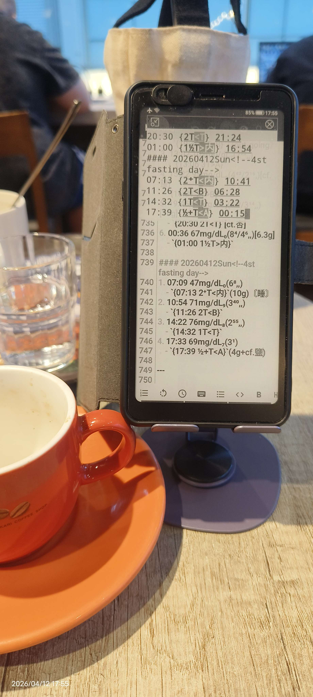
1. 07:09 47mg/dL₀(6⁸,,)
    - `{07:13 2⁺T<内}`(10g)〘睡〙
2. 10:54 71mg/dL₉(3⁴⁰,,)
    - `{11:26 2T<B}`
3. 14:22 76mg/dL₈(2⁵⁵,,)
    - `{14:32 1T<T}`
4. 17:33 69mg/dL₇(3¹)
    - `{17:39 ½+T<A}`(4g+cf.鹽)
5. 19:09 73mg/dL₆(4³⁶/1³⁰,,)[3g+BT]
6. 20:46 79mg/dL₅(6¹³/3⁶,,)
    - `{20:52 1T>内}`
7. 23:40 48mg/dL₄(6¹/2⁴⁸,,)
    - `{23:45 ½T>T}`[11g]
8. 01:45 75mg/dL₃(4⁵³/2⁰,,)
    - `{01:48 ½T>A}`

#### 20260413Mon<!--5th fasting day-->
1. 06:20 29mg/dL₂(6³⁵/4³²,,)[10g]
    - `{06:29 1T<A}`
2. 07:28 83mg/dL₁(0⁵⁸)〘睡〙
3. 10:18 56mg/dL¹(3⁴⁸)
    - `{10:28 ½⁺T>B}`[8g+BC]
4. 13:11 94mg/dL²(6⁴¹/2⁴²,,)
    - `{13:16 ½⁺T<B}`[BT鹽]
5. 16:04 96mg/dL³(5³⁵/2⁴⁷)
    - `{16:10 ½T<T}`

---

